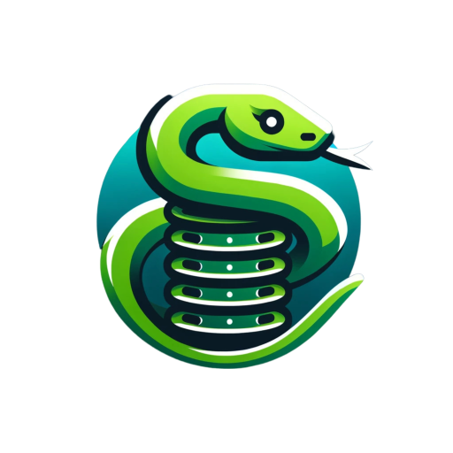
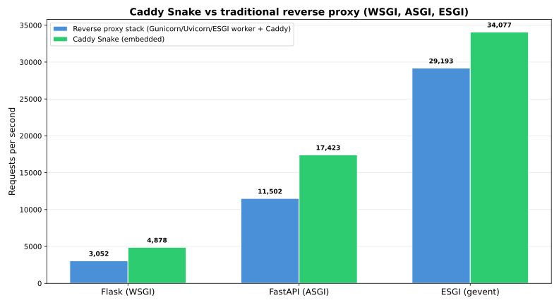

# Caddy Snake 🐍

[](https://github.com/mliezun/caddy-snake/actions/workflows/integration-tests-linux.yml)
[](https://github.com/mliezun/caddy-snake/actions/workflows/integration-tests-windows.yml)
[](https://raw.githack.com/wiki/mliezun/caddy-snake/coverage.html)
[](https://caddy-snake.readthedocs.io/en/latest/)

> [Caddy](https://github.com/caddyserver/caddy) is a powerful, enterprise-ready, open source web server with automatic HTTPS written in Go.

[](https://caddy-snake.readthedocs.io/en/latest/docs/intro)

Caddy Snake is a Caddy plugin that lets you **run Python web apps directly inside Caddy** — no reverse proxy needed.

It embeds Python via the C API, so your WSGI or ASGI application runs in the same process as Caddy. This means less overhead, simpler deployments, and automatic HTTPS out of the box.

To make it easier to get started you can also grab one of the precompiled binaries that come with Caddy and Python, or one of the Docker images.

**Works with Flask, Django, FastAPI, and any other WSGI/ASGI framework.**

---

## Features

- **WSGI, ASGI & ESGI** — serve WSGI and ASGI frameworks, plus [ESGI](https://github.com/mliezun/esgi) apps (blocking `application(scope, protocol)` per connection)
- **Multi-worker** — process-based (default) or thread-based workers for concurrent request handling
- **Auto-reload** — watches `.py` files and hot-reloads your app on changes during development
- **Dynamic module loading** — use Caddy placeholders to load different apps per subdomain or route
- **On-demand TLS permission (`tls.permission.python_dir`)** — gate HTTPS issuance with filesystem checks so wildcard-style hosts work without running a separate ACME [`ask`](https://caddyserver.com/docs/caddyfile/options#on-demand-tls) service (pairs with dynamic `working_dir`)
- **Virtual environment support** — point to a `venv` and dependencies are available automatically
- **WebSocket support** — full WebSocket handling for ASGI apps
- **ASGI lifespan events** — optional startup/shutdown lifecycle hooks
- **Static file serving** — built-in static file support via the CLI
- **Pre-built binaries** — download and run with Python embedded, no compilation required
- **Standalone app binaries** — package your app + Caddy + Python into a single executable (like FrankenPHP)
- **Docker images** — ready-to-use images for Python 3.12 through 3.14
- **Cross-platform** — Linux, macOS, and Windows

---

## Quick start

### Option 1: Download a pre-built binary

The easiest way to get started on Linux is to download a pre-compiled Caddy binary from the [latest release](https://github.com/mliezun/caddy-snake/releases). It comes with Python embedded — no system Python required.

```bash
# Start a WSGI server
./caddy python-server --server-type wsgi --app main:app

# Start an ESGI server
./caddy python-server --server-type esgi --app main:application
```

This starts a server on port `9080` serving your app. See `./caddy python-server --help` for all options:

```
--server-type wsgi|asgi|esgi   Required. Type of Python app
--app <module:var>        Required. Python module and app variable (e.g. main:app)
--domain <example.com>    Enable HTTPS with automatic certificates
--listen <addr>           Custom listen address (default: :9080)
--workers <count>         Number of worker processes (default: CPU count)
--python-path <path>      Path to Python executable (default: embedded Python)
--working-dir <path>      Working directory for the Python app
--venv <path>             Path to virtual environment
--static-path <path>      Serve a static files directory
--static-route <route>    Route prefix for static files (default: /static)
--debug                   Enable debug logging
--access-logs             Enable access logs
--lifespan on|off         Enable ASGI lifespan events (default: off)
--runtime <name>           WSGI: sync|gevent; ESGI: gevent only; ASGI: native|uvloop (see docs)
--autoreload              Watch .py files and reload on changes
```

### Option 2: Build from source

```bash
CGO_ENABLED=1 xcaddy build --with github.com/mliezun/caddy-snake
```

#### Requirements

- Python >= 3.12 + dev files
- C compiler and build tools
- Go >= 1.26 and [xcaddy](https://github.com/caddyserver/xcaddy)

Install on Ubuntu 24.04:

```bash
sudo apt-get install python3-dev build-essential pkg-config golang
go install github.com/caddyserver/xcaddy/cmd/xcaddy@latest
```

### Option 3: Use a Docker image

Docker images are available with Python 3.12, 3.13, and 3.14:

```Dockerfile
FROM mliezun/caddy-snake:latest-py3.13

WORKDIR /app
COPY . /app

CMD ["caddy", "run", "--config", "/app/Caddyfile"]
```

Images are published to both registries:

- [Docker Hub](https://hub.docker.com/r/mliezun/caddy-snake)
- [GitHub Container Registry](https://github.com/mliezun/caddy-snake/pkgs/container/caddy-snake)

### Option 4: Package your app as a standalone binary

Package your Python app, Caddy, and Python into a single executable:

```bash
# Create app zip (Lambda-style: app + deps at root)
cd myapp && pip install -r requirements.txt -t package && cd package && zip -r ../app.zip . && cd ..
zip -g app.zip main.py

# Build standalone binary
cd caddy-snake/cmd/embed-app
./build.sh /path/to/myapp/app.zip 3.13 --output myapp

./myapp  # Serves on :9080
```

See [Apps as Standalone Binaries](https://caddy-snake.readthedocs.io/en/latest/docs/embed-app/) for the full guide.

---

## Usage examples

### ESGI (experimental)

Caddy Snake can serve **[ESGI](https://github.com/mliezun/esgi)** applications — synchronous gateway apps with one invocation per HTTP or WebSocket connection and blocking I/O on a `protocol` object (see the [protocol draft](https://github.com/mliezun/esgi/blob/main/PROTOCOL.md)). **`module_esgi` uses gevent only** (no asyncio in the ESGI worker). For **`module_wsgi` / `module_asgi`**, see the **`runtime`** row in the table below (`native` / **`uvloop`** apply only to ASGI).

`main.py` (sketch)

```python
def application(scope, protocol):
    if scope["proto"] == "http":
        body = protocol.read_body()
        protocol.response_bytes(200, [("Content-Type", "text/plain")], b"ok")
    elif scope["proto"] == "ws":
        ws = protocol.accept()
        ...
        protocol.close()
```

`Caddyfile`

```caddyfile
http://localhost:9080 {
    route {
        python {
            module_esgi "main:application"
            runtime gevent
        }
    }
}
```

See the [ESGI integration](https://caddy-snake.readthedocs.io/en/latest/docs/esgi) doc for the roadmap, `runtime` semantics, and how this relates to WSGI/ASGI.

### Flask (WSGI)

`main.py`

```python
from flask import Flask

app = Flask(__name__)

@app.route("/hello-world")
def hello():
    return "Hello world!"
```

`Caddyfile`

```Caddyfile
http://localhost:9080 {
    route {
        python {
            module_wsgi "main:app"
        }
    }
}
```

```bash
pip install Flask
./caddy run --config Caddyfile
```

```bash
curl http://localhost:9080/hello-world
# Hello world!
```

### FastAPI (ASGI)

`main.py`

```python
from fastapi import FastAPI

app = FastAPI()

@app.get("/hello-world")
def hello():
    return "Hello world!"
```

`Caddyfile`

```Caddyfile
http://localhost:9080 {
    route {
        python {
            module_asgi "main:app"
            lifespan on
        }
    }
}
```

```bash
pip install fastapi
./caddy run --config Caddyfile
```

```bash
curl http://localhost:9080/hello-world
# Hello world!
```

---

## Caddyfile reference

The `python` directive supports the following subdirectives:

```Caddyfile
python {
    module_wsgi "module:variable"       # WSGI app (e.g. "main:app")
    module_asgi "module:variable"       # ASGI app (e.g. "main:app")
    module_esgi "module:variable"       # ESGI app (gevent worker; requires gevent installed)
    runtime sync|gevent|native|uvloop   # See table; ESGI allows gevent only
    venv "/path/to/venv"                # Virtual environment path
    working_dir "/path/to/app"          # Working directory for module resolution
    workers 4                           # Number of worker processes (default: CPU count)
    lifespan on|off                     # ASGI lifespan events (default: off)
    autoreload                          # Watch .py files and reload on changes
}
```

You must specify exactly one of `module_wsgi`, `module_asgi`, or `module_esgi`.

### `module_wsgi`

The Python module and WSGI application variable to import, in `"module:variable"` format.

### `module_asgi`

The Python module and ASGI application variable to import, in `"module:variable"` format.

### `module_esgi`

The Python module and ESGI application callable to import (`def application(scope, protocol): ...` or `__esgi__`), in `"module:variable"` format. See [ESGI](https://caddy-snake.readthedocs.io/en/latest/docs/esgi).

### `runtime`

Selects how the Python worker schedules work at the gateway boundary:

| Interface | Allowed values | Default (when omitted) |
| --- | --- | --- |
| `module_wsgi` | `sync`, `gevent` | `sync` |
| `module_esgi` | **`gevent`** only | `gevent` |
| `module_asgi` | `native`, `uvloop` | `uvloop` |

`native` uses the standard `asyncio` loop. **`uvloop`** selects the [uvloop](https://github.com/MagicStack/uvloop) event loop when the package is installed (with a warning and fallback to native asyncio if it is not). For **WSGI**, **`gevent`** is still the thread-pool compatibility mode unless/until a dedicated gevent stack is added. **ESGI** always runs the **gevent** `StreamServer` stack on plain sockets (install **`gevent`** in your app environment).

**ESGI:** application code is synchronous (`def` + blocking `protocol` methods). The **ESGI Python subprocess does not use asyncio** for the Go-facing socket; it uses **gevent** only.

### `venv`

Path to a Python virtual environment. Behind the scenes, this appends `venv/lib/python3.x/site-packages` to `sys.path` so installed packages are available to your app.

> **Note:** The venv packages are added to the global `sys.path`, which means all Python apps served by Caddy share the same packages.

### `working_dir`

Sets the working directory for Python module resolution and relative paths. This is important when deploying with systemd (which defaults to `/`) or in monorepo/container setups where your app lives in a subdirectory.

```Caddyfile
python {
    module_wsgi "main:app"
    venv "/var/www/myapp/venv"
    working_dir "/var/www/myapp"
}
```

### `workers`

Number of worker processes to spawn. Defaults to the number of CPUs (`GOMAXPROCS`).

### `lifespan`

Enables ASGI [lifespan events](https://asgi.readthedocs.io/en/latest/specs/lifespan.html) (`startup` and `shutdown`). Only applies to ASGI apps. Defaults to `off`.

### `autoreload`

Watches the working directory for `.py` file changes and automatically reloads the Python app. Useful during development.

Changes are debounced (500ms) to handle rapid edits.

```Caddyfile
python {
    module_wsgi "main:app"
    autoreload
}
```

---

## Dynamic module loading

You can use [Caddy placeholders](https://caddyserver.com/docs/caddyfile/concepts#placeholders) in `module_wsgi`, `module_asgi`, `working_dir`, and `venv` to dynamically load different Python apps based on the request.

This is useful for multi-tenant setups where each subdomain or route serves a different application:

```Caddyfile
*.example.com:9080 {
    route /* {
        python {
            module_asgi "{http.request.host.labels.2}:app"
            working_dir "{http.request.host.labels.2}/"
        }
    }
}
```

In this example, a request to `app1.example.com` loads the app from the `app1/` directory, `app2.example.com` loads from `app2/`, and so on. Apps are lazily created on first request and cached for subsequent requests.

---

## On-demand TLS without `ask`

[Caddy on-demand TLS](https://caddyserver.com/docs/caddyfile/options#on-demand-tls) issues certificates for hostnames as clients connect. That flow normally requires an **`ask`** HTTP endpoint — unless you plug in a **`tls.permission.*`** module.

Caddy Snake ships **`tls.permission.python_dir`**, which allows issuance only when the hostname matches **`{slug}.{domain_suffix}`** (exactly one label before the suffix) and **`{root}/{slug}`** exists as a directory — the same layout you use for dynamic Python apps.

Minimal pattern (wildcard HTTPS site + dynamic `working_dir`; adjust **`domain_suffix`** and placeholder index to match your host shape):

```Caddyfile
{
    email you@yourcompany.com

    on_demand_tls {
        permission python_dir {
            root /srv/apps
            domain_suffix project.example
        }
    }
}

https://*.project.example {
    tls {
        on_demand
    }

    route /* {
        python {
            module_asgi "{http.request.host.labels.2}:app"
            working_dir "/srv/apps/{http.request.host.labels.2}/"
        }
    }
}
```

Use a working mailbox on a **registrable domain** for `email` (Let's Encrypt rejects contacts at `example.com` and similar). For nip.io-style hosts and WSGI-only setups, see the **[configuration reference](https://caddy-snake.readthedocs.io/en/latest/docs/reference/)** and **[examples](https://caddy-snake.readthedocs.io/en/latest/docs/examples/)**.

For **[nip.io](https://nip.io/)** names like **`app7.203.0.113.43.nip.io`**, the slug sits at **`{http.request.host.labels.6}`** (seven labels total).

---

## Hot reloading

There are two approaches for hot reloading during development:

### Built-in autoreload (recommended)

Add the `autoreload` directive to your Caddyfile. This watches for `.py` file changes and reloads the app in-place without restarting Caddy:

```Caddyfile
python {
    module_wsgi "main:app"
    autoreload
}
```

### Using watchmedo (alternative)

You can also use [watchmedo](https://github.com/gorakhargosh/watchdog?tab=readme-ov-file#shell-utilities) to restart Caddy on file changes:

```bash
# Install on Debian/Ubuntu
sudo apt-get install python3-watchdog

watchmedo auto-restart -d . -p "*.py" --recursive \
    -- caddy run --config Caddyfile
```

Note that this restarts the entire Caddy process on changes.

---

## Build with Docker

There's a template file in the project: [builder.Dockerfile](/builder.Dockerfile). It supports build arguments to configure which Python or Go version to use.

```bash
# Build the Docker image
docker build -f builder.Dockerfile --build-arg PY_VERSION=3.13 -t caddy-snake-builder .

# Extract the caddy binary to your current directory
docker run --rm -v $(pwd):/output caddy-snake-builder
```

Make sure to match the Python version with your target environment.

---

## Benchmarks

Caddy Snake outperforms traditional reverse proxy setups — **2.4x faster** than Flask+Gunicorn and **1.6x faster** than FastAPI+Uvicorn:



| Configuration | Requests/sec | Avg Latency (ms) | P99 Latency (ms) |
|---|---|---|---|
| Flask + Gunicorn + Caddy | 1,592 | 63.81 | 89.18 |
| **Flask + Caddy Snake** | **3,782** | **26.42** | **41.46** |
| FastAPI + Uvicorn + Caddy | 3,537 | 28.20 | 282.19 |
| **FastAPI + Caddy Snake** | **5,730** | **17.44** | **31.11** |

> Benchmarked on Scaleway POP2-2C-8G (linux/amd64) with [hey](https://github.com/rakyll/hey) — 100 concurrent connections, 10s duration, 10 runs averaged, Python 3.13, Go 1.26, process workers. See [benchmarks/](benchmarks/) for methodology and how to reproduce.

---

## Platform support

| Platform       | Workers runtime   | Notes                                    |
|----------------|-------------------|------------------------------------------|
| Linux (x86_64) | process, thread   | Primary platform, full support           |
| Linux (arm64)  | process, thread   | Full support                             |
| macOS          | process, thread   | Full support                             |
| Windows        | thread only       | Process workers not supported on Windows |

**Python versions:** 3.12, 3.13, 3.13-nogil (free-threaded), 3.14

---

## LICENSE

[MIT License](/LICENSE).
