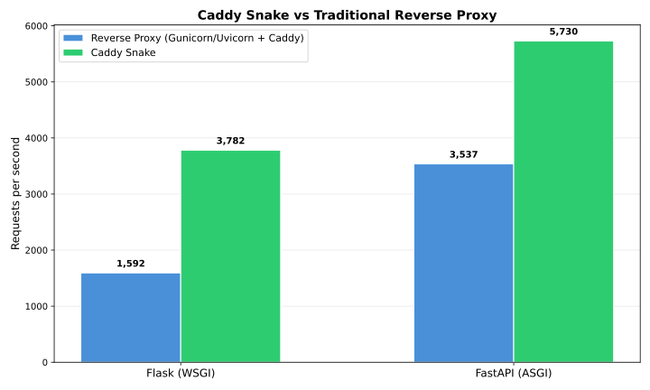

# Benchmarks

Caddy Snake embeds Python directly inside Caddy, eliminating the overhead of a reverse proxy. This page compares Caddy Snake against traditional deployment setups.

## Test configurations

| Configuration | Description |
|---|---|
| Flask + Gunicorn + Caddy | Gunicorn (1 worker, 4 threads) behind Caddy reverse proxy |
| Flask + Caddy Snake | Flask served directly by Caddy via caddy-snake (thread worker) |
| FastAPI + Uvicorn + Caddy | Uvicorn (1 worker) behind Caddy reverse proxy |
| FastAPI + Caddy Snake | FastAPI served directly by Caddy via caddy-snake (thread worker) |

All configurations serve a minimal JSON "Hello, World!" endpoint.

## Results



| Configuration | Requests/sec | Avg Latency (ms) | P99 Latency (ms) |
|---|---|---|---|
| Flask + Gunicorn + Caddy | 4,231 | 23.60 | 37.70 |
| Flask + Caddy Snake | 4,670 | 21.40 | 42.00 |
| FastAPI + Uvicorn + Caddy | 13,347 | 7.50 | 83.70 |
| FastAPI + Caddy Snake | 9,559 | 10.40 | 19.80 |

For Flask (WSGI), Caddy Snake is roughly on par with Gunicorn behind a reverse proxy, with ~10% more throughput and slightly lower average latency. For FastAPI (ASGI), Uvicorn has higher throughput, but Caddy Snake delivers significantly lower P99 latency (19.8ms vs 83.7ms), meaning more consistent response times.

## Methodology

- **Tool:** [hey](https://github.com/rakyll/hey)
- **Concurrency:** 100 connections
- **Duration:** 10 seconds per test
- **Warmup:** 200 requests at 10 concurrency before each test
- **Platform:** Ubuntu 22.04, linux/amd64
- **Python:** 3.13
- **Go:** 1.25
- **Workers:** Caddy Snake uses thread workers; Gunicorn uses 1 worker with 4 threads; Uvicorn uses 1 worker

## Reproduce

Run the benchmarks yourself from the repository root:

```bash
docker build -t caddy-snake-bench -f benchmarks/Dockerfile .
docker run --rm -v $(pwd)/benchmarks:/workspace/benchmarks caddy-snake-bench
```

Results are saved to `benchmarks/results.json` and charts are generated at `benchmarks/benchmark_chart.png` and `benchmarks/benchmark_chart.svg`.

### What the benchmark does

1. Builds Caddy with the caddy-snake plugin from source
2. Sets up a Python 3.13 virtual environment with Flask, FastAPI, Gunicorn, and Uvicorn
3. For each configuration:
   - Starts the server(s)
   - Runs a warmup phase (200 requests)
   - Benchmarks with 100 concurrent connections for 10 seconds
   - Records requests/sec, average latency, and P99 latency
4. Generates a comparison chart and results JSON
