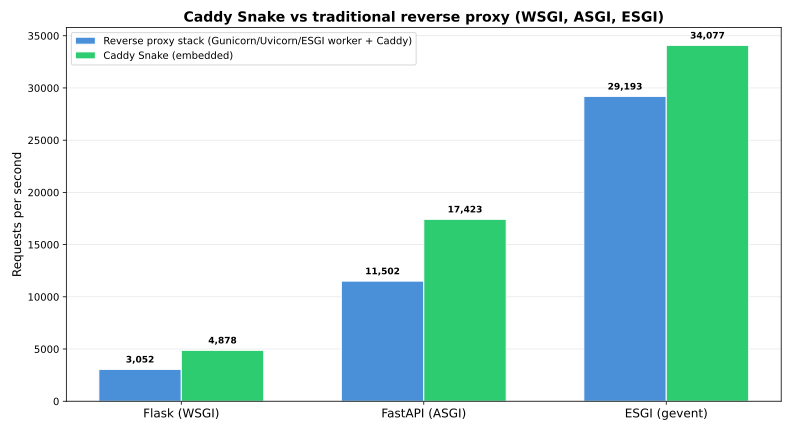

# Benchmarks

Caddy Snake avoids a separately configured Gunicorn/Uvicorn hop. Numbers below match [`benchmarks/results.json`](https://github.com/mliezun/caddy-snake/blob/main/benchmarks/results.json) from a **4 vCPU / 16 GB linux/amd64** VM (Docker harness).

## Results



| Configuration | Requests/sec | Avg Latency (ms) | P99 Latency (ms) |
|---|---|---|---|
| Flask + Gunicorn + Caddy | 3,052 | 32.70 | 37.68 |
| **Flask + Caddy Snake** | **4,878** | **20.49** | **28.25** |
| FastAPI + Uvicorn + Caddy | 11,502 | 8.70 | 91.46 |
| **FastAPI + Caddy Snake** | **17,423** | **5.72** | **8.85** |
| ESGI (gevent) + Caddy reverse proxy | 29,193 | 3.43 | 9.97 |
| **ESGI + Caddy Snake** | **34,077** | **2.95** | **8.10** |

On this hardware: Flask ~60% more RPS than Gunicorn-behind-Caddy; FastAPI ~51% more RPS than Uvicorn-behind-Caddy with a much tighter P99; ESGI is closest (same gevent gateway) but still ~17% faster embedded.

## Methodology

- [hey](https://github.com/rakyll/hey), 100 connections, 10s, 200-request warmup, 10 repeats averaged
- Minimal JSON `GET /hello` → `{"message":"Hello, World!"}`
- Python 3.13, Go 1.26; Caddy Snake uses one process worker in the benchmark Caddyfiles

## Reproduce

```bash
# Any machine with Docker
docker build -t caddy-snake-bench -f benchmarks/Dockerfile .
docker run --rm -v "$(pwd)/benchmarks":/workspace/benchmarks caddy-snake-bench

# Dedicated Scaleway instance (optional)
BENCH_RSYNC_LOCAL=1 ./benchmarks/scaleway_bench.sh
```

Copy updated charts into the docs site:

```bash
cp benchmarks/benchmark_chart.svg docs/static/img/benchmark_chart.svg
```
